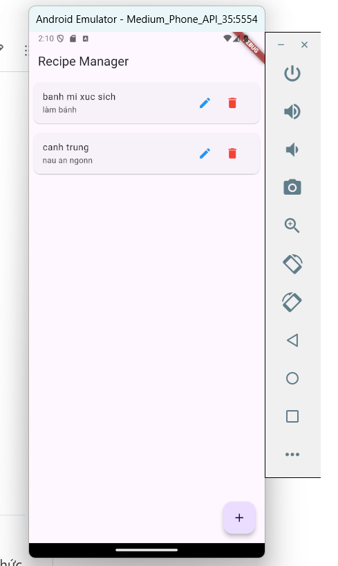
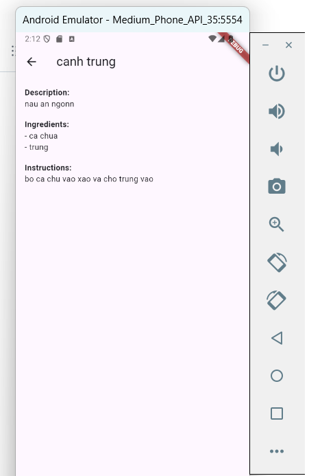
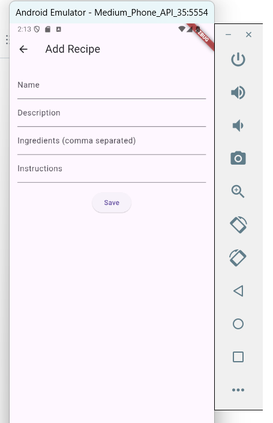
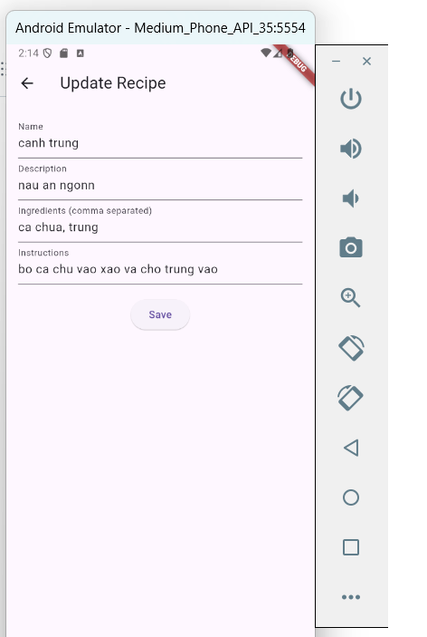

## Báo cáo kết quả Dự Án: Ứng Dụng Quản Lý Công Thức Nấu Ăn.
1. Mục tiêu đề tài.
- Ứng dụng quản lý công thức nấu ăn là một ứng dụng Flutter đa nền tảng được phát triển để giúp người dùng lưu trữ, cập nhật, và quản lý các công thức nấu ăn. Ứng dụng này tương tác với cơ sở dữ liệu MySQL thông qua một API REST. Mục tiêu của dự án là xây dựng một ứng dụng dễ sử dụng, có giao diện hiện đại và hỗ trợ đầy đủ các tính năng CRUD (Tạo, Đọc, Cập nhật, Xóa).
2. Công nghệ sử dụng:
- **Flutter và ngôn ngữ Dart**: Để xây dựng giao diện người dùng.
- **Http**: Để gọi API và xử lý HTTP request.
- **Mysql**: Để lưu trữ dữ liệu.
- **Test Framework (flutter_test)**: Sử dụng để viết các bài kiểm thử tự động.
3. Các tính năng chính của ứng dụng:
- Hiển thị danh sách công thức nấu ăn.
- Thêm công thức mới.
- Cập nhật và xóa công thức.
- Xem chi tiết công thức nấu ăn.
4. Các testcase đã thực hiện.
- Kiểm thử UI (widget test): cho các trang thêm,sửa,xóa và và giao diện màn hình.
5. Các ảnh và Video demo kết quả làm bài.
- Ảnh giao diện trang chủ.

- Ảnh chi tiết món ăn.

- Ảnh thêm món ăn.

-Ảnh sửa món ăn.

- Video demo các testcase: 
<video controls src="demotest.mp4" title="testcase"></video>
- video demo sản phẩm:
<video controls src="demosanpham.mp4" title="demosanpham"></video>

## Yêu cầu nộp bài
- **Source code**: Đẩy toàn bộ mã nguồn lên GitHub repository cá nhân và chia sẻ quyền truy cập.
- **Kiểm thử tự động**: Sinh viên cần viết các bài kiểm thử tự động cho ứng dụng. Các bài kiểm thử cần được tổ chức rõ ràng và dễ hiểu trong thư mục `test` với hậu tố `_test.dart`. Các bài kiểm thử đơn vị (unit test) cần kiểm tra các chức năng cơ bản của ứng dụng và đảm bảo chất lượng mã nguồn. Kiểm thử UI (widget test) cần được viết để kiểm tra giao diện người dùng và các tương tác người dùng cơ bản.
- **Các video demo**: 
  - Quá trình kiểm thử tự động bao gồm kiểm thử đơn vị và kiểm thử UI (bắt buộc).
  - Trình bày các chức năng chính của ứng dụng (bắt buộc).
  Các video cần biên tập sao cho rõ ràng, dễ hiểu và không quá dài (tối đa 5 phút).
- **Báo cáo kết quả**: Đây là nội dung báo cáo của bài tập lớn. Sinh viên cần viết báo cáo ngắn mô tả quá trình phát triển, các thư viện đã sử dụng và các kiểm thử đã thực hiện. Có thể viết trực tiếp trên file README.md này ở mục `Báo cáo kết quả`.
- **GitHub Actions**: Thiết lập GitHub Actions để chạy kiểm thử tự động khi có thay đổi mã nguồn. Tệp cấu hình workflow cần được đặt trong thư mục `.github/workflows`, đặt tên tệp theo định dạng `ci.yml` (có trong mẫu của bài tập lớn). Github Actions cần chạy thành công và không có lỗi nếu mã nguồn không có vấn đề. Trong trường hợp có lỗi, sinh viên cần sửa lỗi và cập nhật mã nguồn để build thành công. Nếu lỗi liên quan đến `Billing & plans`, sinh viên cần thông báo cho giảng viên để được hỗ trợ hoặc bỏ qua yêu cầu này.

## Tiêu chí đánh giá
**5/10 điểm - Build thành công (GitHub Actions báo “Success”)**
- Sinh viên đạt tối thiểu 5 điểm nếu GitHub Actions hoàn thành build và kiểm thử mà không có lỗi nào xảy ra (kết quả báo “Success”).
- Điểm này dành cho những sinh viên đã hoàn thành cấu hình cơ bản và mã nguồn có thể chạy nhưng có thể còn thiếu các tính năng hoặc có các chức năng chưa hoàn thiện.
- Nếu gặp lỗi liên quan đến `Billing & plans` thì phải đảm bảo chay thành công trên máy cá nhân và cung cấp video demo cùng với lệnh `flutter test` chạy thành công.

**6/10 điểm - Thành công với kiểm thử cơ bản (CRUD tối thiểu)**
- Sinh viên đạt 6 điểm nếu build thành công và vượt qua kiểm thử cho các chức năng CRUD cơ bản (tạo, đọc, cập nhật, xóa) cho đối tượng chính.
- Tối thiểu cần thực hiện CRUD với một đối tượng cụ thể (ví dụ: sản phẩm hoặc người dùng), đảm bảo thao tác cơ bản trên dữ liệu.

**7/10 điểm - Kiểm thử CRUD và trạng thái (UI cơ bản, quản lý trạng thái)**
- Sinh viên đạt 7 điểm nếu ứng dụng vượt qua các kiểm thử CRUD và các kiểm thử về quản lý trạng thái.
- Giao diện hiển thị danh sách và chi tiết đối tượng cơ bản, có thể thực hiện các thao tác CRUD mà không cần tải lại ứng dụng.
- Phản hồi người dùng thân thiện (hiển thị kết quả thao tác như thông báo thành công/thất bại).

**8/10 điểm - Kiểm thử CRUD, trạng thái và tích hợp API hoặc/và CSDL**
- Sinh viên đạt 8 điểm nếu ứng dụng vượt qua kiểm thử cho CRUD, trạng thái, và tích hợp API hoặc/và cơ sở dữ liệu (Firebase, MySQL hoặc lưu trữ cục bộ) hoặc tương đương.
- API hoặc cơ sở dữ liệu phải được tích hợp hoàn chỉnh, các thao tác CRUD liên kết trực tiếp với backend hoặc dịch vụ backend.
- Các lỗi từ API hoặc cơ sở dữ liệu được xử lý tốt và có thông báo lỗi cụ thể cho người dùng.

**Tóm tắt các mức điểm:**
- **5/10**: Build thành công, kiểm thử cơ bản chạy được.
- **6/10**: CRUD cơ bản với một đối tượng.
- **7/10**: CRUD và quản lý trạng thái (hiển thị giao diện cơ bản).
- **8/10**: CRUD, trạng thái, và tích hợp API/CSDL với thông báo lỗi.
- **9/10**: Hoàn thiện kiểm thử CRUD, trạng thái, tích hợp API/CSDL; UI thân thiện.
- **10/10**: Tối ưu hóa hoàn chỉnh, UI/UX mượt mà, CI/CD đầy đủ và ổn định.

## Tự đánh giá điểm: 8/10
Sinh viên cần tự đánh giá mức độ hoàn thiện của ứng dụng và so sánh với tiêu chí đánh giá để xác định điểm cuối cùng. Điểm tự đánh giá sẽ được sử dụng như một tiêu chí tham khảo cho giảng viên đánh giá cuối cùng.

Chúc các bạn hoàn thành tốt bài tập lớn và khám phá thêm nhiều kiến thức bổ ích qua dự án này!
